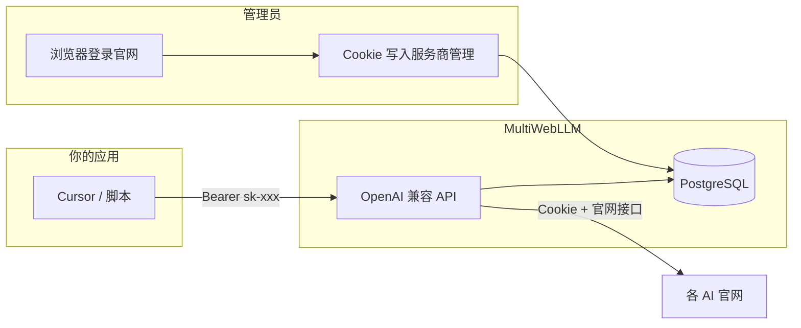

# MultiWebLLM

[](LICENSE)

**自用 AI 网关**：在服务器上保存你在浏览器登录各 AI 官网后的 **Cookie**，对外提供 **OpenAI 兼容 API**（`/v1/chat/completions`），让 Cursor、脚本或其它应用走你的 **网页订阅额度**，而不是另购第三方中转 API。

> 定位：个人 / 小团队自托管，**不是** 多租户商用中转（无计费分号、无账号池调度）。

## 支持的服务商

| 类型 | 服务商 | 说明 |
|------|--------|------|
| **网页聊天（推荐）** | ChatGPT、Claude、Gemini、Grok、Kimi | Cookie 登录官网，走私有 Web API |
| **自定义** | 任意 OpenAI 兼容端点 | 管理后台添加：基础地址 + Cookie/Token/API Key + API 路径 |

模型列表在管理后台 **「模型配置」** 中同步，默认只保留各服务商 **最新一代** 代表模型。

## 工作模式（简图）



**要点**：只有 **服务商管理** 里保存的 Cookie 会进入 `providers.auth_data` 并用于聊天；设置页的「批量更新 Cookie」目前仅写入 `settings.json`，**不会**参与转发（见 [`aiproxy/README.md`](aiproxy/README.md)）。

## 仓库结构

| 目录 | 说明 |
|------|------|
| [`aiproxy/`](aiproxy/) | 核心：API、管理后台、Docker |
| [`extensions/multiwebllm-cookie-bridge/`](extensions/multiwebllm-cookie-bridge/) | Chrome 扩展：一键导出 Cookie |
| [`site/`](site/) | 官网与文档站点 |

## 快速开始（Docker）

```bash
git clone https://github.com/multiwebllm/multiwebllm.git
cd multiwebllm

cp aiproxy/.env.example aiproxy/.env
# 必改：DB_PASSWORD、ADMIN_PASSWORD、JWT_SECRET、CRON_SECRET

docker compose up -d multiwebllm-db multiwebllm-redis
docker compose --profile init run --rm multiwebllm-init
docker compose up -d --build
```

- 管理后台：<http://127.0.0.1:3000/login>（默认账号见 `aiproxy/.env`）
- 侧栏 **服务状态**：显示本机到各官网的 HTTP 延迟（ms）
- 定时巡检容器 `multiwebllm-health-cron` 会按 `CRON_SECRET` 调用健康检查 API

### 推荐配置顺序

1. **服务商管理** — 填入 Cookie（扩展一键获取 / Cookie Editor JSON / 剪贴板），点 **测试**
2. **模型配置** — **同步模型**（需有效 Cookie）
3. **API 密钥** — 创建 `sk-...`，在应用里当 OpenAI API Key 使用
4. **系统设置**（可选）— Telegram 通知、巡检间隔、限流等

## API 示例

```bash
# 列出可用模型（需先在后台创建 API Key）
curl http://127.0.0.1:3000/v1/models \
  -H "Authorization: Bearer sk-your-api-key"

# 流式对话（model 为后台「模型配置」中的 model_id）
curl http://127.0.0.1:3000/v1/chat/completions \
  -H "Authorization: Bearer sk-your-api-key" \
  -H "Content-Type: application/json" \
  -d '{
    "model": "claude-sonnet-4.7",
    "messages": [{"role": "user", "content": "你好"}],
    "stream": true
  }'
```

兼容路径：`/api/v1/chat/completions` 与 `/v1/chat/completions` 等价。

## Cookie 获取

1. 安装 [`multiwebllm-cookie-bridge`](extensions/multiwebllm-cookie-bridge/) 扩展（开发者模式加载）
2. 在 Chrome 中登录对应 AI 网站
3. 打开 **服务商管理** → 编辑服务商 → **扩展一键获取** 或粘贴 Cookie Editor 导出的 JSON

## 本地开发

```bash
cd aiproxy
npm install
cp .env.example .env

docker compose up -d multiwebllm-db multiwebllm-redis   # 在仓库根目录执行
npm run db:push && npm run db:seed
npm run dev
```

文档站：`cd site && npm install && npm run dev`

## 技术栈

Next.js 16 · TypeScript · PostgreSQL · Redis · Drizzle · shadcn/ui · Docker Compose

## 文档

- 实现细节与数据流：[`aiproxy/README.md`](aiproxy/README.md)
- 扩展说明：[`extensions/multiwebllm-cookie-bridge/README.md`](extensions/multiwebllm-cookie-bridge/README.md)

## 免责声明

- Cookie 等同于账号登录态，请勿泄露、勿提交到公开仓库。
- 通过非官方 Web API 转发存在 **账号风控** 可能，请仅自用并定期在官网重新登录后更新 Cookie。
- 本项目按「原样」提供，作者不对第三方服务条款或封号风险负责。

## License

MIT — 见 [LICENSE](LICENSE)
