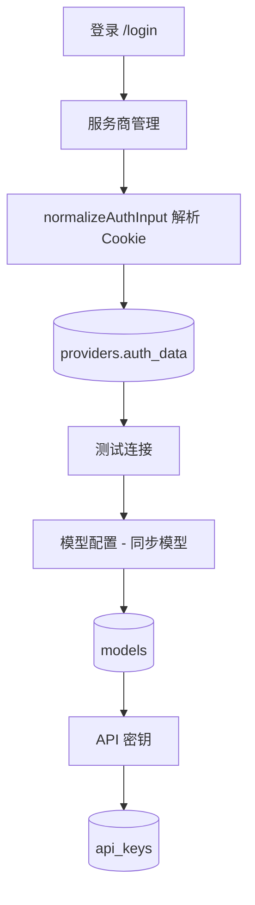
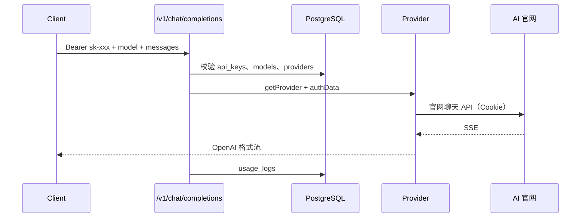

# MultiWebLLM（核心服务）

[`multiwebllm` 仓库根目录](../README.md) 中的主应用：管理后台 + OpenAI 兼容 API + 服务商转发层。

## 这是什么

MultiWebLLM 把「浏览器里已登录的 AI 网页会话」搬到服务器上，用 **Cookie** 代替你在每台设备上重复登录，对外暴露与 OpenAI 相近的 HTTP 接口，便于：

- 在 **Cursor / Continue / 自写脚本** 里填 `base_url` + `api_key` 统一调用多家模型
- 用 **自己的 ChatGPT Plus / Claude / Gemini** 等订阅，而不是再买一份 OpenAI Platform 余额
- 在 **一台机器**（家用 NAS、VPS、本机 Docker）上集中管理密钥与用量

## 功能一览

| 模块 | 能力 |
|------|------|
| **OpenAI API** | `GET /v1/models`、`POST /v1/chat/completions`（流式）、图片生成（部分模型） |
| **服务商管理** | Cookie / Token 配置、连接测试、Cookie 桥接扩展 |
| **模型配置** | 从官网拉取模型列表，仅保留最新主版本档；清理旧版/无关模型 |
| **API 密钥** | 多 Key、配额、每分钟限流 |
| **运维** | 用量记录、监控图表、侧栏官网延迟（ms） |
| **巡检** | 定时检测 Cookie 有效性，可选 Telegram 提醒 |

### 网页聊天服务商（一等公民）

`chatgpt` · `claude` · `gemini` · `grok` · `kimi`

模型同步、侧栏延迟探测、内置模型目录均围绕以上五家。

### 自定义服务商

在管理后台选择 **「自定义服务商」**，填写基础地址、认证信息（Cookie / Token / API Key）及 OpenAI 兼容的聊天、模型列表路径（默认 `/v1/chat/completions`、`/v1/models`）。自定义 slug 由你指定，网关通过 `CustomProvider` 转发请求。

## 系统工作模式

### 1. 配置阶段（管理后台）



### 2. 调用阶段（对外 API）



### 3. Cookie 存储：两条路径对比

| 路径 | 入口 | 写入位置 | 是否用于聊天 |
|------|------|----------|--------------|
| ✅ 正确 | **服务商管理** → 认证数据 | `providers.auth_data` | 是 |
| ❌ 当前无效 | **系统设置** → 批量更新 Cookie | `settings.json` 的 `provider_id` / `cookies` 字段 | 否 |

请在 **服务商管理** 中维护 Cookie。批量更新区块尚未对接数据库，保存后不会影响转发。

### 4. 运维与巡检

- **侧栏「服务状态」**：异步请求 `GET /api/admin/providers/latency`，由 **本机** 对 `baseUrl` 发 HTTP 探测，显示 `xxx ms`
- **健康巡检**：`POST /api/admin/health` 或 Cron `GET /api/cron/provider-health`（Header: `Authorization: Bearer $CRON_SECRET`）
- **模型清理**：`POST /api/admin/models/cleanup`、`POST /api/admin/models/sync`（同步前会删非五家服务商模型与 inactive 旧档）

## 技术栈

| 层 | 技术 |
|----|------|
| Web | Next.js 16 App Router、React、shadcn/ui |
| 数据 | PostgreSQL + Drizzle ORM |
| 缓存 | Redis（限流等） |
| 配置 | `aiproxy/.env` + 运行时 `settings.json` |

## 部署

在 **仓库根目录**（推荐）：

```bash
cp aiproxy/.env.example aiproxy/.env
# 编辑：DB_PASSWORD、ADMIN_PASSWORD、JWT_SECRET、CRON_SECRET

docker compose up -d multiwebllm-db multiwebllm-redis
docker compose --profile init run --rm multiwebllm-init
docker compose up -d --build
```

服务默认绑定 `127.0.0.1:3000`。`multiwebllm-health-cron` 容器每日触发巡检（具体间隔由后台「系统设置」控制，API 内会判断是否跳过）。

### 环境变量（节选）

| 变量 | 说明 |
|------|------|
| `DATABASE_URL` | PostgreSQL 连接串 |
| `ADMIN_USERNAME` / `ADMIN_PASSWORD` | 管理后台登录 |
| `JWT_SECRET` | 管理端 Session |
| `REDIS_URL` | Redis |
| `CRON_SECRET` | 定时巡检鉴权 |
| Telegram | 在后台设置，非 `.env` 必填 |

完整列表见 [`.env.example`](.env.example)。

## 本地开发

```bash
npm install
cp .env.example .env
# DATABASE_URL 指向 localhost，见 .env.example 注释

# 在仓库根目录启动依赖
docker compose up -d multiwebllm-db multiwebllm-redis

npm run db:push
npm run db:seed
npm run dev
```

## API

### 鉴权

```http
Authorization: Bearer <在后台创建的 API Key>
```

### 聊天

```bash
curl http://localhost:3000/v1/chat/completions \
  -H "Authorization: Bearer sk-xxxx" \
  -H "Content-Type: application/json" \
  -d '{
    "model": "gpt-5.5",
    "messages": [{"role": "user", "content": "Hello"}],
    "stream": true
  }'
```

`model` 使用表 `models.model_id`；转发官网时使用 `upstream_model`（若已配置）。

### 模型列表

```bash
curl http://localhost:3000/v1/models \
  -H "Authorization: Bearer sk-xxxx"
```

## 配置 Cookie（详细）

### 方式 A：浏览器扩展（推荐）

1. 加载 [`../extensions/multiwebllm-cookie-bridge`](../extensions/multiwebllm-cookie-bridge/)
2. 服务商页填写正确 **基础地址**（如 `https://chatgpt.com`）
3. 在 Chrome 登录该站后点击 **扩展一键获取**

扩展导出格式与 Cookie Editor JSON 兼容；后台会按域名过滤并压缩存储。

### 方式 B：手动粘贴

支持：

- Cookie Editor 导出的 JSON 数组
- `{"cookies": {"name": "value", ...}}`
- 纯 `name=value; name2=value2` 字符串

解析逻辑见 [`src/lib/auth-data.ts`](src/lib/auth-data.ts)。

### 方式 C：授权弹窗

**打开登录页** → 在新窗口完成登录 → **登录后获取 Cookie**（依赖扩展）。

## 项目结构

```
src/
├── app/
│   ├── api/v1/              # OpenAI 兼容 API
│   ├── api/admin/           # 管理 API（含 providers/latency、models/sync）
│   ├── api/cron/            # 定时巡检
│   ├── dashboard/           # 管理页面
│   └── login/
├── lib/
│   ├── providers/           # 各服务商转发实现
│   ├── models/              # 目录、版本裁剪、legacy 过滤
│   ├── auth-data.ts         # Cookie 解析
│   ├── provider-health.ts   # 健康检查
│   └── provider-latency.ts  # 侧栏延迟探测
└── components/
```

## 管理 API（节选）

| 方法 | 路径 | 说明 |
|------|------|------|
| GET | `/api/admin/providers` | 服务商列表 |
| PUT | `/api/admin/providers/:id` | 更新 Cookie（会 normalize） |
| POST | `/api/admin/providers/:id/test` | 测试连接 |
| GET | `/api/admin/providers/latency` | 官网延迟 |
| POST | `/api/admin/models/sync` | 同步模型 |
| POST | `/api/admin/models/cleanup` | 清理无关/旧模型 |

均需管理端登录 Cookie（`admin_token`）。

## 常见问题

**Q: 同步模型全是目录占位、官网拉不到？**  
A: Cookie 无效或过期。请在对应官网重新登录后更新服务商 Cookie，再点同步。

**Q: 聊天 401 / 403？**  
A: 检查 API Key、模型是否 `active`、服务商是否 `active` 且 `auth_data` 非空。

**Q: 和 Sub2API / 商用中转有何不同？**  
A: 本项目面向 **自用 Cookie + 网页 API**，不做多用户计费与账号池。商用 OAuth 中转请参考其它项目。

**Q: Cookie 会过期吗？**  
A: 会。开启 Telegram 巡检后可在失效时提醒；建议定期在官网登录并更新。

## License

MIT
